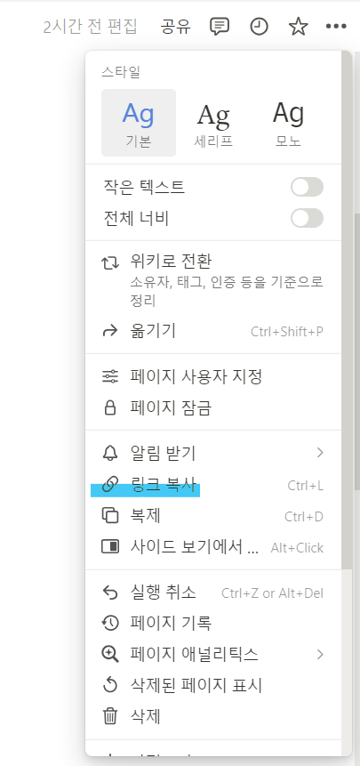

# 프로그램 사용 방법

1. .env 파일의 구성

   ```
   TOKEN={Notion 워크스페이스의 Auth 토큰}
   PAGE={page id}
   ```

   1. TOKEN: 인포팀장에게 문의
   2. PAGE
      

   - 링크 복사를 한 뒤, 마지막 '-'와 '?' 사이에 있는 숫자와 영어 소문자로 이루어진 string이 page id입니다.
   - (ex. 2265677e6as52124bbf73126836a88b4)

2. 실행 방법
   1. conda 가상환경을 생성합니다.
   ```
   conda create -f automation.yaml
   conda activate automation
   ```
   2. 정보국 회의록 서식 한글 파일을 엽니다. (중요)
   3. automation.py를 실행합니다. (올바른 conda로 실행 환경이 설정되었는지 확인합니다.)
