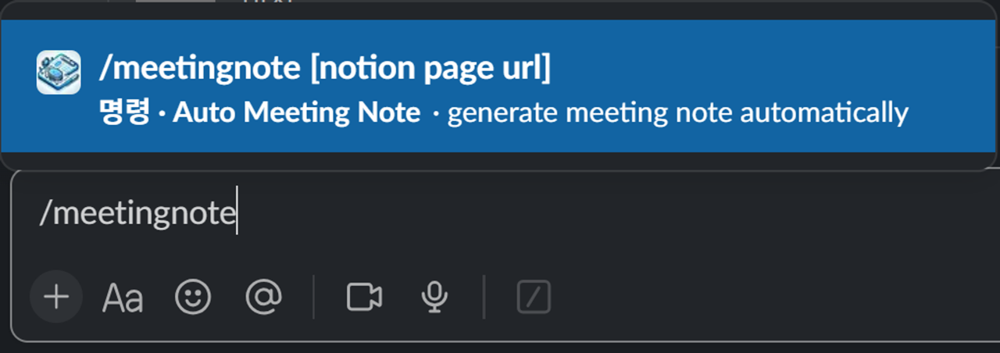
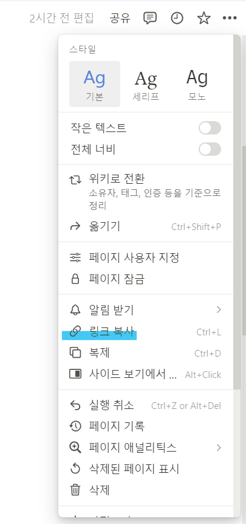
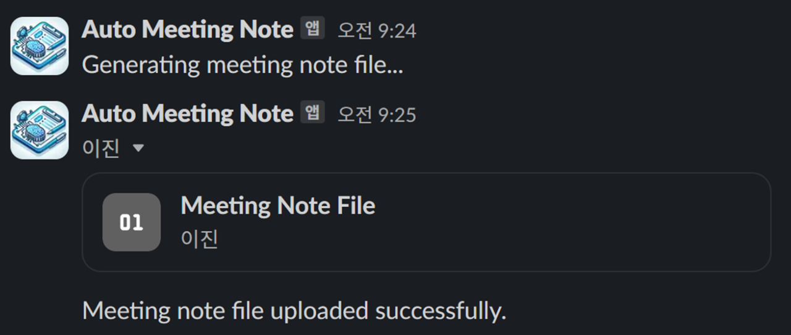

# 프로그램 사용 방법

### 1. .env 파일의 구성

```
NOTION_TOKEN={Notion 워크스페이스의 Auth 토큰}
SLACKBOT_TOKEN={Slack bot 'Auto Meeting Note'의 Auth 토큰}
```

1.  NOTION_TOKEN: 인포팀장에게 문의
2.  SLACKBOT_TOKEN: 문의 (또는 slackbot 설정 페이지에 존재)

### 2. 실행 방법

1.  conda 가상환경을 생성한다.

    ```
    conda create -f automation.yaml
    conda activate automation
    ```

2.  main.py를 실행한다. (올바른 conda로 실행 환경이 설정되었는지 확인)
3.  로컬 서버에 대해 ngrok 터널 시작 (authtoken, 포트번호에 유의)

    ```
    ngrok authtoken <YOUR_AUTH_TOKEN>
    ngrok http 5000
    ```

4.  ngrok 대시보드에서 "Forwarding" 항목의 https URL을 복사한다.
5.  slackbot slash command 설정 페이지에서 '/meetingnote'명령의 Request URL에 4번에서 복사한 URL을 붙여넣은 후, 바로 뒤에 "/slack/command"를 덧붙인다. (문의)

### 3. Slack Slash Command 실행 방법 및 결과

1.  인포팀 내 # meeting_notes 채널에 들어간다.
2.  채팅으로 `/meetingnote [notion page url]`를 입력한다.
    - 이 때 [notion page url]에는 노션 회의록 페이지 링크를 복사해서 넣는다. <br/>
      
    - 노션 회의록 페이지 링크 위치 <br/>
      
3.  아래와 같이 slack bot이 회의록을 생성해 채널에 업로드해준다.
    
